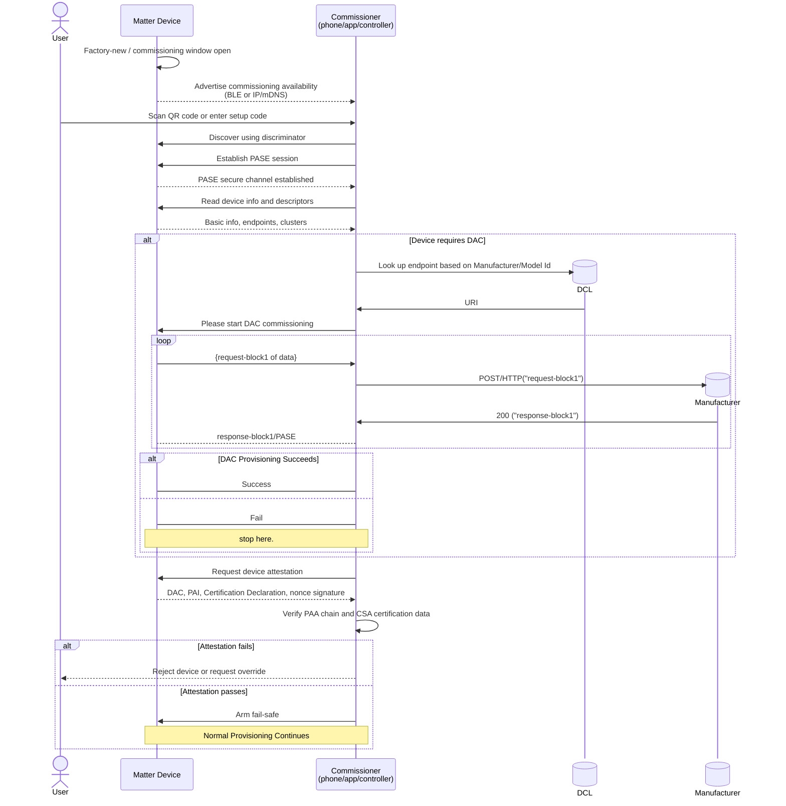

```mermaid
sequenceDiagram
    actor User
    participant Device as Matter Device
    participant Commissioner as Commissioner<br/>(phone/app/controller)

 
    Device->>Device: Factory-new / commissioning window open
    Device-->>Commissioner: Advertise commissioning availability<br/>(BLE or IP/mDNS)

    User->>Commissioner: Scan QR code or enter setup code
    Commissioner->>Device: Discover using discriminator

    Commissioner->>Device: Establish PASE session
    Device-->>Commissioner: PASE secure channel established

    Commissioner->>Device: Read device info and descriptors
    Device-->>Commissioner: Basic info, endpoints, clusters
    alt Device requires DAC
        create participant DCL@{"type" : "database" }
        Commissioner->>DCL: Look up endpoint based on Manufacturer/Model Id
        DCL->>Commissioner: URI
        Commissioner->>Device: Please start DAC commissioning
        loop
            Device->>Commissioner: {request-block1 of data}
            create participant Manufacturer@{"type" : "database" }
            Commissioner->>Manufacturer: POST/HTTP("request-block1")
            Manufacturer->>Commissioner: 200 ("response-block1")
            Commissioner-->Device: response-block1/PASE
        end
        alt DAC Provisioning Succeeds
            Device->Commissioner: Success
        else
            Device->Commissioner: Fail
            note over Device,Commissioner: stop here.
        end
    end
    Commissioner->>Device: Request device attestation
    Device-->>Commissioner: DAC, PAI, Certification Declaration, nonce signature
    Commissioner->>Commissioner: Verify PAA chain and CSA certification data

    alt Attestation fails
        Commissioner-->>User: Reject device or request override
    else Attestation passes
        Commissioner->>Device: Arm fail-safe

        Note over Commissioner,Device: Normal Provisioning Continues 
    end
```